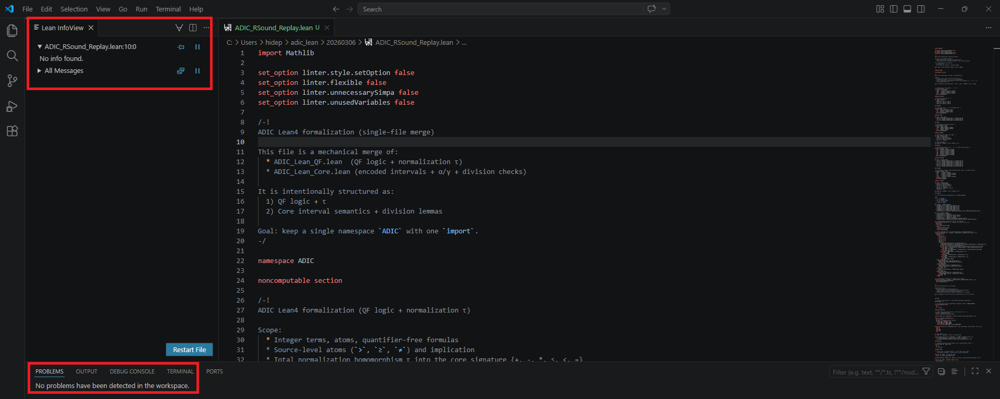
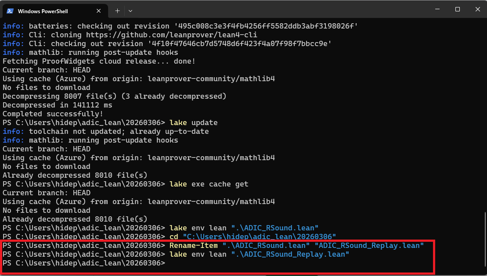

# ADIC R-SOUND Replay Verification

This repository contains a Lean 4 formalization of replay-based soundness for ADIC certificates.

The main file is:

```text
ADIC_RSound_Replay.lean
```

This version extends the earlier core-only `ADIC_RSound.lean` formalization by focusing on the replay verification layer.

## Scope

This repository formalizes the Lean-side replay soundness structure for ADIC.

In particular, it covers the connection between:

```text
certificate rows
spec rows
replay verification
semantic validity
acceptance soundness
```

The goal is not to verify an entire deployed software system, but to provide a mechanically checked formal core for the replay verification argument used in ADIC.

## Main theorem direction

At a high level, the file establishes that if an ADIC certificate is accepted by the replay verifier, then the corresponding semantic validity condition follows.

This supports the ADIC idea that audit acceptance should not be a loose runtime judgment, but a reproducible verification result.

## Requirements

This project uses:

```text
Lean 4.28.0
Mathlib
Lake
```

## Verification

Run:

```powershell
lake update
lake exe cache get
lake env lean ".\ADIC_RSound_Replay.lean"
```

Successful verification means the final command returns to the prompt with no output.

Example:

```powershell
PS> lake env lean ".\ADIC_RSound_Replay.lean"
PS>
```

## Verification evidence

The Lean file was checked in two ways.

### VS Code / Lean InfoView

The file reports:

```text
No problems have been detected in the workspace.
```



### Command-line verification

The file also passes from PowerShell:

```powershell
lake env lean ".\ADIC_RSound_Replay.lean"
```

The command returns to the prompt with no Lean messages.



## Repository structure

```text
ADIC_RSound_Replay.lean   Main Lean formalization
README.md                 Repository description
docs/lean-infoview-pass.png
docs/powershell-pass.png
```

## Positioning

ADIC is an audit architecture for making AI-related decisions reproducible, verifiable, and accountable.

This Lean formalization represents the mathematical verification core behind that position: accepted certificates should imply formally stated semantic validity, rather than relying on informal log inspection or post-hoc explanation.

## Related paper

Preprint: URL to be added.

## Status

The current file has been checked with:

```powershell
lake env lean ".\ADIC_RSound_Replay.lean"
```

and passes when the command returns with no Lean messages.
